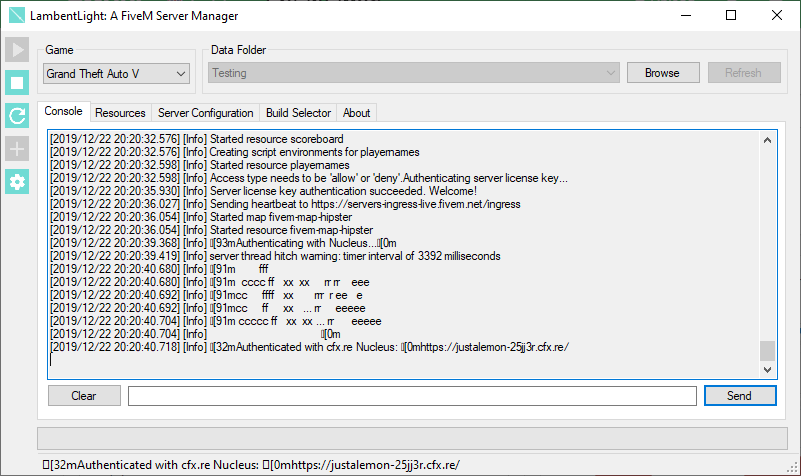

# LambentLight <small>for FiveM</small>

[![5mods][5mods-img]][5mods-url] [![Documentation][docs-img]][docs-url] [![AppVeyor][appveyor-img]][appveyor-url] [![CodeFactor][codefactor-img]][codefactor-url] [![Discord][discord-img]][discord-url]

LambentLight is an application for managing dedicated FiveM servers. It helps you with a bunch of tedious tasks:

* Keeping your server safe by using the latest available build, no more manual updating of builds
* Integrated resource installer, so you no longer need to browse the FiveM forums for installing every dependency manually
* Ability to change your server settings from inside of the application
* The server is restarted automatically if it crashes, no need to worry for a 24/7 operation
* Automatic scheduled restarts, so you can update builds and resources at specific times of the day
* Is 100% Free and Open Source under the MIT License

    

[5mods-img]: https://img.shields.io/badge/5mods-download-20BA4E.svg
[5mods-url]: https://www.gta5-mods.com/tools/servermanager
[docs-img]: https://github.com/LambentLight/LambentLight/workflows/Documentation/badge.svg
[docs-url]: https://github.com/LambentLight/LambentLight/actions?query=workflow%3ADocumentation
[appveyor-img]: https://img.shields.io/appveyor/ci/justalemon/lambentlight.svg?label=appveyor
[appveyor-url]: https://ci.appveyor.com/project/justalemon/lambentlight
[codefactor-img]: https://www.codefactor.io/repository/github/lambentlight/lambentlight/badge
[codefactor-url]: https://www.codefactor.io/repository/github/lambentlight/lambentlight
[discord-img]: https://img.shields.io/badge/discord-join-7289DA.svg
[discord-url]: https://discord.gg/Cf6sspj
