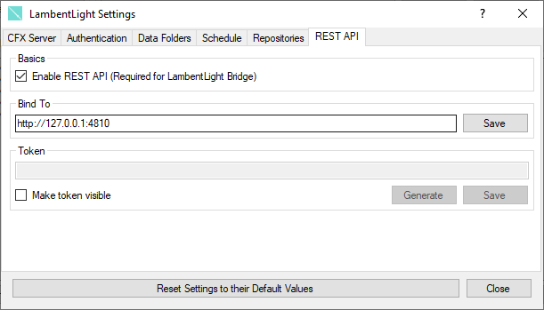

# About the Web API

!!! danger
    The REST API is an experimental feature. Breaking changes might happen between releases. This is not a production ready feature.

## What is the Web API?

The Web API is a RESTful JSON Web API for managing the FiveM Server via HTTP Requests. This allows you to control the server from anything that supports HTTP Requests like Discord Bots or Mobile Apps.

## How can I use it?

To use the Web API, you need to enable it on the LambentLight settings:

Then, you can call any of the following endpoints with the correct [authentication](authentication.md):
