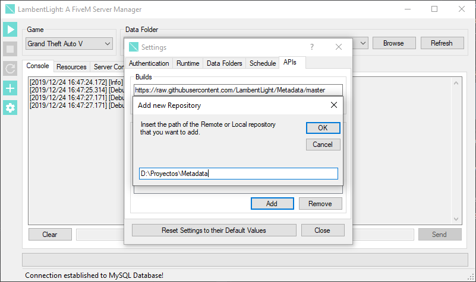

# Metadata Repositories

!!! tip
    Common resources are those that can be installed in both RedM and FiveM.

LambentLight gets the Resources and Builds from Metadata folders or repositories. They just contain JSON files that tell the program where to download the resources and the builds that the CitizenFX Collective has made. Because they are simple folders with text files, the format is pretty simple:

* `builds.json` contains a list of CFX Build identifiers (the URLs can't be changed, and this is intentional)
* `resources` contains the information of the resources that can be installed
    *  `resources/common.json`, `resources/gtav.json` and `resources/rdr2.json` contains the basic information for Common, FiveM and RedM resources (Name and Author only)
    * `resources/common`, `resources/gtav` and `resources/rdr2` contain files with the extended information of the resources (everything from the Download URLs, to manual patches that need to be done)

## Creating new Repositories

First, you need to [install the LambentLight tools](tools.md). After that, you just need to:

* Open a console or terminal (on Windows, press WIN+R, write `cmd` and press enter/return)
* Change the working directory to the folder that you want to use (`cd /d YOUR_FOLDER_PATH_HERE`)
* Write `python -m lambentlight newrepo` and press enter
* The files required by LambentLight will be created

Now you have a working Metadata folder that LambentLight can use.

## Testing new Metadata Folders

Testing your new Metadata Folder is easy, you just need to add it in the LambentLight API Configuration.

