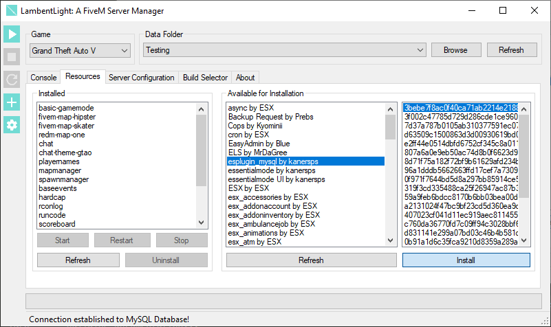
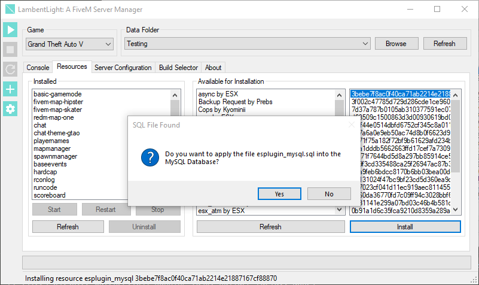

# Resource Manager

LambentLight allows you to manage Resources, from the basics of Start, Stop and Restart to updating and installing new ones with a couple of clicks. To access it, you just need to select the `Resources` tab. 

## Installing

To install new resources, you need to select one of them in the `Available for Installation` area, and then the version. After that, you just press the `Install` button to download and save the selcted resource.

If you have a [MySQL Database configured](mysql.md) and the resource comes with .sql files, you will be asked if you want to import them one by one (this behaviour can be changed in the configuration).

## Uninstalling

The Uninstall procedure is the same as the Installation: You select a resource in the `Installed` list and press `Uninstall`.

You will be asked if you are sure that you want to Uninstall the resource, just press `Yes`.

